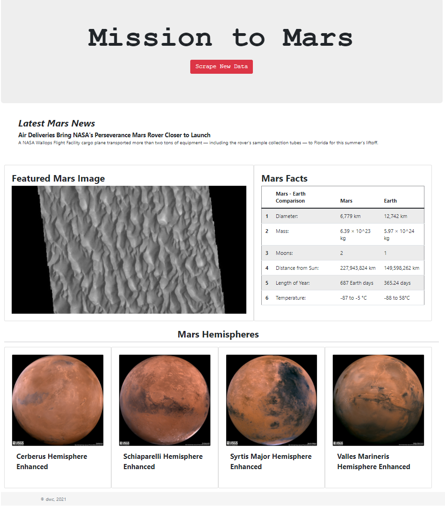

<h1 align="center">Web Scraping Challenge - <i>Mission to Mars</i></h1>

🅼🅸🆂🆂🅸🅾🅽 🆃🅾 🅼🅰🆁🆂

 

A web application that scrapes various websites for data related to the Mission to Mars and displays the information in a single HTML page. 

### Websites used for scraping
<a href='https://redplanetscience.com/'>https://redplanetscience.com/</a> 
<a href='https://spaceimages-mars.com/'>https://spaceimages-mars.com/</a> 
<a href='https://galaxyfacts-mars.com/'>https://galaxyfacts-mars.com/</a> 
<a href='https://marshemispheres.com/'>https://marshemispheres.com/</a> 

### Contents:

        /mission_to_mars - ipynb for scrape demo, app.py for flask app, scrape_mars.py for scraping app
                /templates - html for the website
                /static/css - css for styling

